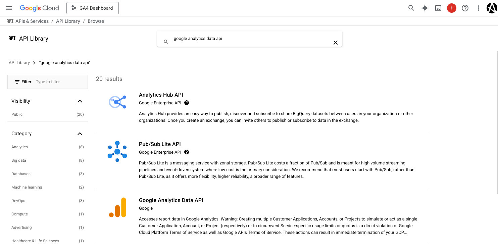
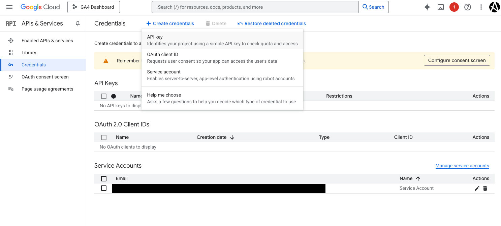
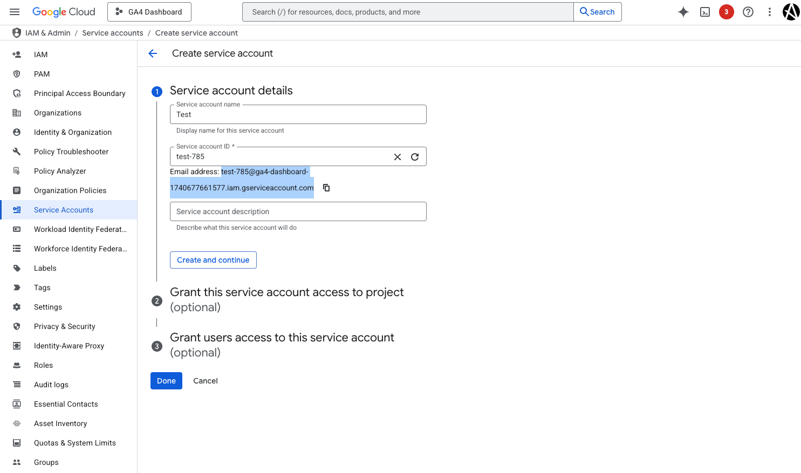

# Google Analytics 4 (GA4) Custom Dashboard

This project demonstrates how to integrate **Google Analytics 4 (GA4)** with a **Next.js** application, leveraging the **GA4 Data API** to fetch and analyze user interaction data programmatically. The integration enables seamless tracking of user behavior and dynamic reporting of key metrics, such as active users, page views, and more.

---

## **Project Overview**
This project was built to:
1. **Track User Interactions**: Use GA4 to monitor page views and user interactions on a Next.js application.
2. **Fetch Data Programmatically**: Utilize the GA4 Data API to retrieve analytics data for reporting and analysis.
3. **Ensure Secure Authentication**: Authenticate API requests using a Google Cloud Service Account for secure access to GA4 data.

---
## **Project Setup**
1. You will need to login to your Google Console and select API & Services
2. Click on the "Library" tab and search for ``google analytics data api`` in the Search for APIs & Services search box.
   - Click the "Google Analytics Data API" Button and click Enable.
      

3. Once enabled you will go to the "Credentials" tab and at the top middle of the screen click "+Create Credentials".
   
   - Click "Service account" and fill in the appropriate fields. You will to copy the email address field onces all the fields are fill in this will be used later in your .env.local file. In this case the value is ``test-644@ga4-dashboard-1740677661577.iam.gserviceaccount.com``
   

---

## **Key Features**
- **GA4 Tracking**: Integrated GA4 tracking to monitor user interactions and page views.
- **Dynamic Data Fetching**: Used the GA4 Data API to fetch metrics like active users, session duration, and more.
- **Secure Authentication**: Implemented secure authentication using a Google Cloud Service Account.
- **Custom Reporting**: Built custom dashboards and reports using the fetched GA4 data.
- **Password Modal for Secure API Access**: Added a password modal to restrict access to sensitive API requests. The modal ensures that only authenticated users can make requests to the GA4 Data API.
---

## **How It Works**
1. **GA4 Tracking**:
   - The project integrates GA4 tracking into the Next.js app to monitor user interactions and page views.
   - Page views are tracked dynamically as users navigate through the app.

2. **GA4 Data API**:
   - The GA4 Data API is used to fetch analytics data programmatically.
   - Metrics such as active users, page views, and session duration are retrieved for analysis.

3. **Authentication**:
   - A Google Cloud Service Account is used to authenticate API requests securely.
   - The Service Account has access to the GA4 property, ensuring data privacy and security.

4. **Custom Reporting**:
   - The fetched data is used to generate custom reports and dashboards.
   - These reports provide insights into user behavior and app performance.

5. **Password Modal**:
   - A password modal was added to restrict API requests, ensuring that only users with the correct credentials can access and fetch data.
   - The modal was created using **Shadcn** for an elegant and user-friendly design.

   

---

## **Technologies Used**
- **Next.js**: A React framework for building server-rendered and static web applications.
- **Google Analytics 4 (GA4)**: For tracking user interactions and analyzing app performance.
- **GA4 Data API**: For programmatically fetching analytics data.
- **Google Cloud Service Account**: For secure authentication and API access.
- **Shadcn**: Used for building the password modal.

---

## **Project Structure**
The project is organized into the following components:
1. **GA4 Tracking**: Integrated into the Next.js app to monitor user interactions.
2. **API Integration**: Uses the GA4 Data API to fetch analytics data.
3. **Authentication**: Securely authenticates API requests using a Google Cloud Service Account.
4. **Reporting**: Generates custom reports and dashboards using the fetched data.
5. **Password Modal**: Restricts access to sensitive API endpoints using a password modal created with Shadcn.

---

## **How to Use**
1. **Set Up GA4**:
   - Create a GA4 property in your Google Analytics account.
   - Add the GA4 tracking script to your Next.js app.

2. **Enable GA4 Data API**:
   - Enable the GA4 Data API in your Google Cloud project.
   - Create a Service Account and grant it access to your GA4 property.

3. **Fetch Data**:
   - Use the GA4 Data API to fetch analytics data programmatically.
   - Retrieve metrics like active users, page views, and session duration.

4. **Generate Reports**:
   - Use the fetched data to generate custom reports and dashboards.
   - Analyze user behavior and app performance.

5. **Password Modal**:
   - When accessing secure endpoints, users will be prompted with a password modal.
   - Enter the correct credentials to gain access to the API data.

---

## **Benefits**
- **Real-Time Insights**: Gain real-time insights into user behavior and app performance.
- **Custom Reporting**: Build custom reports tailored to your needs.
- **Secure Authentication**: Ensure secure access to GA4 data using a Service Account.
- **Scalable Solution**: Designed to scale with your app and user base.

---

## **License**
This project is licensed under the MIT License. See the [LICENSE](LICENSE) file for details.
